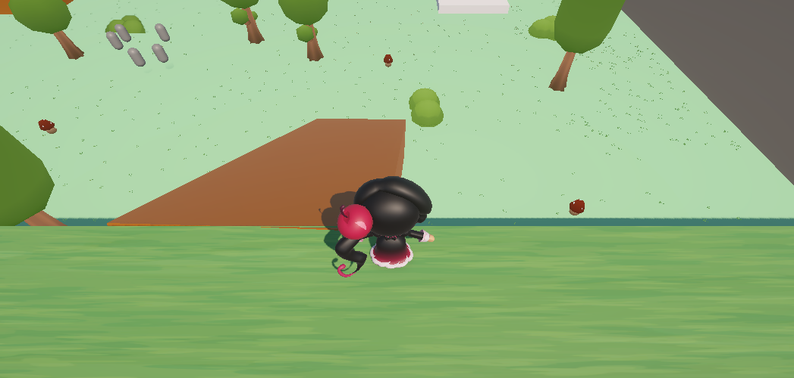

# TP1_Prg1

Juego de plataformas 3D desarrollado en Unity

## Descripción

Controlás a una galleta que debe recorrer un escenario de plataformas, y saltando pasando sobre obstáculos o plataformas, mientras explora conseguir un objeto para la cueva

## Versión de Unity

Unity 6.5 (6000.5.8f1)

## Controles

- **Teclas de movimiento (WASD / Flechas)**: mover al personaje
- **E**: recoger y soltar objetos
- **Clic izquierdo / derecho**: activar el poder especial de velocidad

## Mecánicas implementadas

- Movimiento del personaje con cámara que sigue la acción
- Plataformas móviles con temporización
- Generador de enemigos
- Recolección y transporte de objetos con SetParent()
- Power-up temporal de velocidad con corrutina y recarga
- Zona de meta y evento de victoria al entregar el objeto

## Instrucciones para abrir y ejecutar el proyecto

1. Descargar o clonar el repositorio.
2. Abrir Unity Hub y hacer clic en **Add** para agregar la carpeta del proyecto.
3. Abrir la escena principal y presionar **Play**.
4. Usar los controles indicados para jugar.

(opcional puedes ejecutar el menú directamente ya que hay un botón programando una vez dado play te llevara a la escena del nivel)

## Captura del escenario

